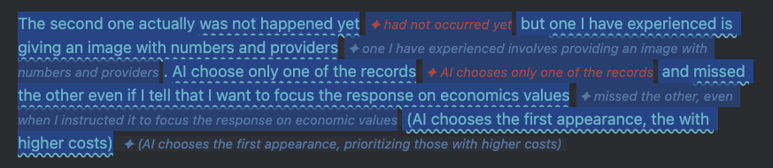
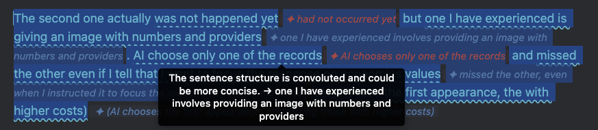
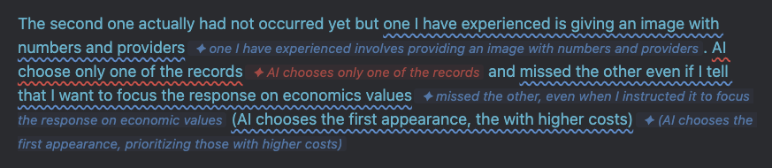

# English Write Checker

An [Obsidian](https://obsidian.md) plugin that analyzes your English writing in real time using a local LLM via [Ollama](https://ollama.com). It highlights grammar errors and style suggestions directly in the editor, with inline replacements you can accept with a single click.

## Features

- **Red underline** — grammar mistakes (wrong tense, missing article, subject-verb disagreement, etc.)
- **Blue underline** — style improvements to reach C1-C2 level vocabulary and register
- Inline suggestion chips shown next to each flagged phrase
- **Click any suggestion** to instantly accept it
- Tooltip with explanation on hover
- Fully local — no data leaves your machine

## Screenshots

### Suggestions displayed inline


### Hover to see the explanation


### Click to accept a suggestion


## Requirements

- [Obsidian](https://obsidian.md) 0.15.0 or higher
- [Ollama](https://ollama.com) running locally
- Model pulled: `gemma3:4b` (or `gemma3:12b` for better quality)

## Installation

1. Clone or download this repository
2. Copy the folder into your vault's plugin directory:
   ```
   <your-vault>/.obsidian/plugins/english-write-checker/
   ```
   The folder must contain only: `main.js`, `manifest.json`, `styles.css`
3. Open Obsidian → **Settings → Community plugins** → enable **English Write Checker**
4. Make sure Ollama is running:
   ```bash
   ollama serve
   ollama pull gemma3:4b
   ```

## Usage

1. Open a note and write or paste English text
2. Select the paragraph you want to analyze
3. Open the Command Palette (`Cmd+P`) → **English Write Checker: Analyze selected text**
4. Click any suggestion chip to accept it, or hover to read the explanation
5. To clear all suggestions: **English Write Checker: Clear all suggestions**

> Tip: assign a hotkey to "Analyze selected text" in **Settings → Hotkeys** for faster access.

## Settings

| Setting | Default | Description |
|---|---|---|
| Ollama endpoint | `http://localhost:11434` | URL where Ollama is running |
| Model | `gemma3:4b` | Change to `gemma3:12b` for higher quality |
| Target level | `C1` | B2, C1, or C2 proficiency target |

## License

MIT © [Julio Gonzales](https://github.com/julioagh)

Based on [write-good-obsidian](https://github.com/marktext/write-good-obsidian) by Mark Hesketh (MIT).
